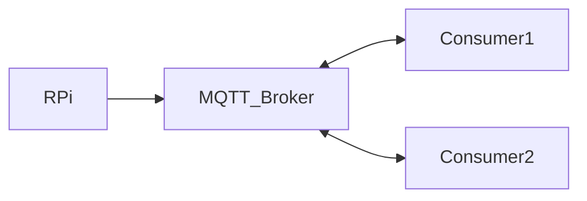

# Python MQTT RPi

MQTT Service for Raspberry Pi using Python



## Installation

Use the package manager [pip](https://pip.pypa.io/en/stable/) to install foobar.

```bash
pip install paho-mqtt
pip install adafruit-circuitpython-dht
sudo apt-get install libgpiod2
```

## Usage

```python
# pub
dhtDevice = adafruit_dht.DHT11(board.D17)
mqttBroker = "test.mosquitto.org"

# sub
client.connect("test.mosquitto.org", 1883, 60)
client.loop_forever()
```

## Contributing
Pull requests are welcome. For major changes, please open an issue first to discuss what you would like to change.

Please make sure to update tests as appropriate.

## License
[MIT](https://choosealicense.com/licenses/mit/)
